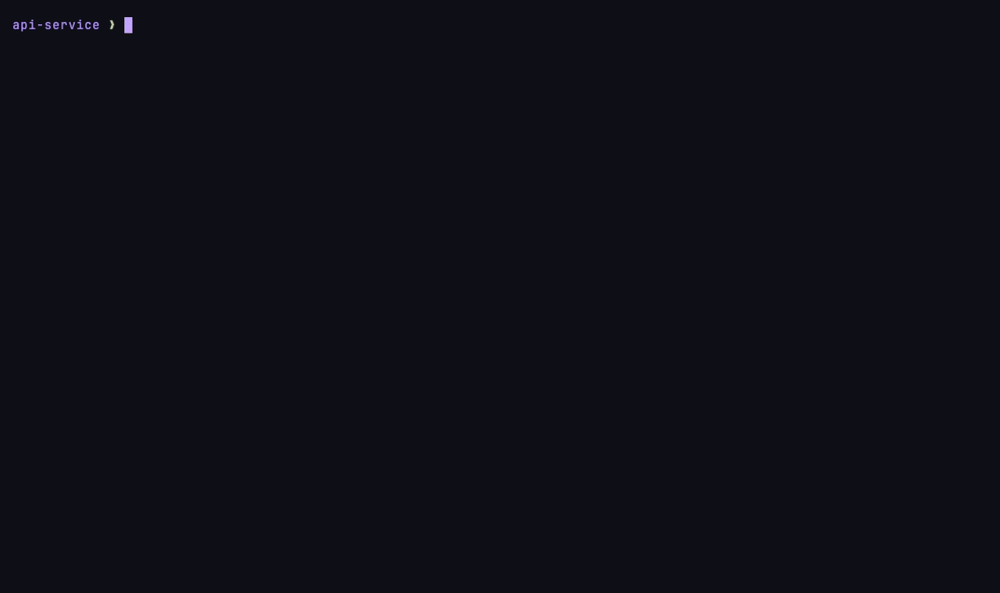

# CommitCraft: AI-Powered Commit Assistant for Developers

CommitCraft is a powerful Terminal User Interface (TUI) tool designed to streamline your Git workflow. It leverages Artificial Intelligence (AI), specifically Groq AI, to generate meaningful, concise, and well-formatted commit messages based on your staged changes. With an interactive experience powered by the Charmbracelet ecosystem, CommitCraft helps you create high-quality commits quickly and effortlessly.

<p align="center">
  
</p>

> Recorded with [VHS](https://github.com/charmbracelet/vhs). It's the real TUI running against a throwaway sandbox pointed at a local AI stand-in, so no Groq calls are made and the data shown is illustrative. See [`demo/`](demo/) to regenerate it.

## ✨ Key Features

- **AI-Powered Commit Message Generation:** Utilizes Groq AI to suggest commit messages based on your staged changes.
- **Interactive Terminal User Interface (TUI):** A smooth and visually appealing user experience built with the Charmbracelet suite (Bubble Tea, Lipgloss, Glamour, Charmtone).
- **Customizable Commit Types:** Define and manage your own commit types (e.g., `feat`, `fix`, `docs`, `style`) with descriptions and colors.
- **Commit Scope Selection:** Select specific files or directories to define the scope of your commit.
- **Flexible Commit Format:** Customize how your final commit message is structured.
- **Customizable AI Prompts:** Adjust the prompt templates used by the AI for full control over the suggestions.
- **Nerd Fonts Support:** Enhance the TUI aesthetics with Nerd Fonts icons for better file and directory visualization.
- **Headless `ai` CLI:** A full `commitcraft ai …` subcommand surface (JSON in/out) so scripts and AI agents can drive the same pipeline without the TUI — generate, verify, edit, promote, merge, release, and more.
- **Agent delegate mode:** Optionally bypass the Groq API entirely and let the calling AI agent produce the message itself from CommitCraft's own prompts, returning it via `ai submit`. See [Agent delegate mode](#-agent-delegate-mode-no-groq).

## 🚀 Installation

CommitCraft is written in Go, making it easy to compile and install across different platforms.

### Requirements

- [Git](https://git-scm.com/) (required for repository interaction)
- [Go 1.25+](https://go.dev/doc/install) (for compiling from source)

### From Source

1.  **Clone the repository:**

    ```bash
    git clone https://github.com/Cerebellum-ITM/CommitCraftReborn.git
    cd CommitCraftReborn
    ```

    *Note: For local development and testing, you might be working directly from the cloned directory.*

2.  **Compile the binary:**
    You can compile the binary for your current operating system:

    ```bash
    go build -o commitcraft ./cmd/cli
    ```

    To cross-compile for other platforms, you can use `GOOS` and `GOARCH`:

    -   **Linux (64-bit Intel/AMD):**

        ```bash
        GOOS=linux GOARCH=amd64 go build -o commitcraft_linux_amd64 ./cmd/cli
        ```

    -   **macOS (64-bit Intel):**

        ```bash
        GOOS=darwin GOARCH=amd64 go build -o commitcraft_darwin_amd64 ./cmd/cli
        ```

    -   **macOS (64-bit Apple Silicon):**

        ```bash
        GOOS=darwin GOARCH=arm64 go build -o commitcraft_darwin_arm64 ./cmd/cli
        ```

    -   **Windows (64-bit):**

        ```bash
        GOOS=windows GOARCH=amd64 go build -o commitcraft_windows_amd64.exe ./cmd/cli
        ```

3.  **Move the binary to your PATH:**
    After compiling, move the resulting binary to a directory that is in your `PATH` (e.g., `/usr/local/bin` or `~/.local/bin`):

    ```bash
    sudo mv commitcraft /usr/local/bin/ # For global installation
    # Or for your user:
    mkdir -p ~/.local/bin
    mv commitcraft ~/.local/bin/
    ```

### From a GitHub Release (Recommended)

Once official releases are available, the easiest way is to download the appropriate pre-compiled binary for your system from the [CommitCraft Releases page](https://github.com/Cerebellum-ITM/CommitCraftReborn/releases).

1.  Download the `commitcraft_<OS>_<ARCH>` file (or `.exe` for Windows).
2.  Unzip it if necessary.
3.  Move the unzipped binary to a directory in your `PATH` (e.g., `/usr/local/bin` or `~/.local/bin`).
4.  Ensure the binary has execute permissions: `chmod +x /path/to/commitcraft`

## ⚙️ Configuration

CommitCraft uses `TOML` configuration files for flexible customization.

### Configuration File Locations

-   **Global Configuration:** `~/.config/commitcraft/config.toml`
    -   If this file does not exist, it will be created automatically with default settings the first time CommitCraft runs.
-   **Local Configuration:** `.commitcraft.toml` in the root directory of your current Git repository.
    -   Local configuration **overrides** global configuration.

### Groq API Key

CommitCraft requires an API Key from [Groq](https://groq.com/) to interact with its AI models.
You can set it up in two ways:

1.  **Using a `.env` file (Recommended & Secure):**
    Create a file named `.env` in the global configuration directory (`~/.config/commitcraft/`) and add your Groq API key to it:

    ```bash
    GROQ_API_KEY="your_groq_api_key_here"
    ```

    CommitCraft will automatically load this file. It's recommended to ensure this file's permissions are set securely (e.g., `chmod 600 ~/.config/commitcraft/.env`).

2.  **Interactive Setup:**
    If `GROQ_API_KEY` is not set, CommitCraft will prompt you for the API Key the first time it runs and save it to the global configuration.

#### Dual key slots

CommitCraft supports **two Groq key slots** — `user` and `ai` — with exactly one
active at a time, so a free-tier rate limit on one key can be sidestepped by
swapping to the other without losing commit consistency. They live in the same
`.env`:

```bash
GROQ_API_KEY="..."        # the "user" slot (active by default)
GROQ_API_KEY_AI="..."     # the "ai" slot
GROQ_ACTIVE_KEY="user"    # "user" | "ai" — which slot is live
```

Manage them with the headless CLI (no secrets are ever printed):

```bash
commitcraft ai key show              # which slots are set + which is active
commitcraft ai key set --slot ai     # store a key in the ai slot (hidden prompt)
commitcraft ai key swap              # toggle the active slot
```

### Customizing Commit Types

You can define your own commit types in your configuration file (`config.toml` or `.commitcraft.toml`).

Example `.commitcraft.toml` for adding custom commit types:

```toml
# .commitcraft.toml
[commit_types]
behavior = "append" # Or "replace" to use only your custom types

[[commit_types.types]]
tag = "STYLE"
description = "Formatting and style adjustments that do not change the meaning of the code."
color = "#E57373" # You can use Hex color codes (#RRGGBB) or Lipgloss color names

[[commit_types.types]]
tag = "TEST"
description = "Adding or correcting tests (unit, integration, e2e)."
color = "#81D4FA"

[[commit_types.types]]
tag = "PERF"
description = "Performance improvements."
color = "#FFB74D"
```

### Customizing AI Prompts

The prompts used by the AI to generate suggestions are templates that you can modify. These files are located in:
`~/.config/commitcraft/prompts/`

The main files are:

-   `change_analyzer.prompt.tmpl`: Stage 1 — analyzes the staged diff + your keypoints into a summary.
-   `commit_body_generator.prompt.tmpl`: Stage 2 — writes the commit body.
-   `commit_title_generator.prompt.tmpl`: Stage 3 — writes the title from the body.
-   `changelog_refiner.prompt.tmpl`: Optional stage — produces a matching `CHANGELOG.md` entry.
-   `release_body/title/refine.prompt.tmpl`: The 3-stage release-notes pipeline (`ai merge` / `ai release`).
-   `agent_commit.prompt.tmpl` / `agent_release.prompt.tmpl`: The unified prompts used by [delegate mode](#-agent-delegate-mode-no-groq).
-   `only_translate.prompt.tmpl`: For translating text.

You can edit these files to tailor the AI's behavior to your needs.

### Nerd Fonts Usage

If you have [Nerd Fonts](https://www.nerdfonts.com/) installed on your system and terminal, you can enable their use in the TUI for better file icon visualization.
In `~/.config/commitcraft/config.toml` (or `.commitcraft.toml`):

```toml
[tui]
use_nerd_fonts = true # Set to false to disable
```

## 🚀 Usage

Once installed and configured, you can run CommitCraft from your terminal:

```bash
commitcraft
```

**Tip:** For quicker access, consider adding an alias to your shell (e.g., `~/.bashrc` or `~/.zshrc`):

```bash
alias gc='commitcraft'
```

Then, simply run `gc` in your terminal.

### Basic Workflow - Generating a Commit Message

1.  **Stage your changes:** Use `git add <files>` or `git add .` as you normally would.
2.  **Run CommitCraft:** `commitcraft` (or `gc`).
3.  **Follow the TUI in the "Writing Message" Stage:**
    *   **Your Input (Left Panel):** Start by typing your initial, short commit message or a brief summary of the changes you've made. This text will guide the AI.
    *   **Switch Between Panels:**
        *   Press **`Tab`** to move your focus from your input to the AI's suggestion panel.
        *   Press **`Shift+Tab`** to move your focus back to your input panel.
    *   **Ask AI for Help:** Press **`Ctrl+W`** to send your input to the AI. You'll see a loading indicator and status updates while the AI generates its suggestion.
    *   **AI's Suggestion (Right Panel):** This area will display the commit message generated by the AI, based on your input and the detected code changes.
    *   **Accept AI Suggestion:** If you're satisfied with the AI's message, press **`Enter`** to finalize and use this commit message.
    *   **Quit:** At any point, you can press **`Ctrl+C`** to exit the application.
4.  **Commit Created:** CommitCraft will execute `git commit` with the generated message.

### Working with Drafts

CommitCraft allows you to save your work-in-progress commits as drafts so you can continue later.

- **Saving a Draft:** While in the commit message editor, press **`Ctrl+S`** at any time to save the current state as a draft.
- **Viewing Drafts:** In the main commit history list, press **`Ctrl+D`**. This will toggle the view to show only your saved drafts.
- **Loading a Draft:** While in the draft view, select a draft and press **`Enter`**. This will load its content back into the editor, allowing you to continue right where you left off.

## 🤖 Headless `ai` CLI

Everything the TUI does is also available through `commitcraft ai …`
subcommands designed for scripts and AI agents. Every command prints **JSON on
stdout** and structured errors on stderr, so the output is easy to parse and
pipe. The typical commit flow is:

```bash
commitcraft ai context --strict                 # offline pre-flight: does the diff fit the model?
commitcraft ai list-tags                         # eligible commit-type tags (default/global/local)
commitcraft ai generate -k "<keypoint>" -t ADD -s <scope>   # run the pipeline → draft (JSON with id)
commitcraft ai verify --id <id>                  # deterministic checks on the final message
commitcraft ai edit --id <id> --title "..."      # patch a field without re-running the model
commitcraft ai regenerate --id <id> --stage body # re-run one stage (or the whole pipeline)
commitcraft ai promote --id <id>                 # mark the draft completed
# then: git commit -m "$(...final_message...)"
commitcraft ai link-commit --id <id> --hash "$(git rev-parse HEAD)"   # recover by hash later
```

Other subcommands: `show` (by id or `--commit <hash>`), `list`,
`list-addable-tags` / `add-tag` (register per-repo tags), `key` (manage the two
Groq slots), and `merge` / `release` which summarize a commit range into a
`[MERGE]` / `[RELEASE]` note via the release pipeline. Run
`commitcraft ai <subcommand> -h` for flags.

### 🪄 Agent delegate mode (no Groq)

When CommitCraft is driven by an AI agent, the 3–4 serial Groq calls per message
add real latency. **Delegate mode** removes the API from the loop: instead of
calling Groq, the CLI emits a **prompt bundle** (the same prompts, filled with
the diff/keypoints/tag/scope) and the already-running agent produces the message
itself, returning it through `commitcraft ai submit`.

Enable it globally in `~/.config/CommitCraft/config.toml`:

```toml
[agent]
mode     = "delegate"   # "" | "groq" (default) | "delegate"
strategy = "single"     # "single" (one unified prompt) | "staged" (per-stage prompts)
```

…or per call with `--agent` / `--no-agent` / `--agent-strategy` on
`generate` / `regenerate` / `merge` / `release`. With no `[agent]` table the
Groq pipeline is unchanged — delegate mode is fully opt-in.

Flow:

```bash
commitcraft ai generate -k "<keypoint>" -t ADD -s <scope>
#   → with delegate mode on, this prints {"mode":"delegate", ...} instead of a draft:
#     a bundle with the filled prompt(s), the staged diff, and the inputs.

# The agent writes the (English) message from the bundle, then submits it:
echo '{"kind":"commit","tag":"ADD","scope":["<scope>"],"keypoints":["<keypoint>"],
       "title":"...","body":"..."}' | commitcraft ai submit
#   → re-reads the staged diff, composes final_message, runs the verifier, and
#     persists the draft. The response embeds a `verify` block.

commitcraft ai promote --id <id>     # then git commit + link-commit as usual
```

`ai submit` accepts the payload on stdin (or `--input-file`); `merge` / `release`
delegate the same way with `kind:"release"`. The
[`commitcraft` skill](https://github.com/Cerebellum-ITM/commitcraft-skill) drives
this end-to-end.

## 🤝 Contributing

Contributions are welcome! If you're interested in improving CommitCraft, please open an issue or submit a Pull Request.

### Git hooks

After cloning, run `make install-hooks` once to enable the versioned `pre-commit` hook that formats staged `.go` files and re-stages them. This keeps every commit pre-formatted so opening files in editors with format-on-save (Neovim, Helix, etc.) doesn't produce stray diffs.

The hook mirrors the conform.nvim Go chain: `gofumpt` → `goimports-reviser` → `golines`, falling back to `gofmt` when none are installed. Install the chain with:

```bash
make install-fmt
```

That runs `go install` for each tool. Make sure `$(go env GOPATH)/bin` is on your `$PATH` so the hook can find them (Mason-installed binaries only live inside Neovim).

## 📄 License

This project is under the [MIT License](LICENSE).
