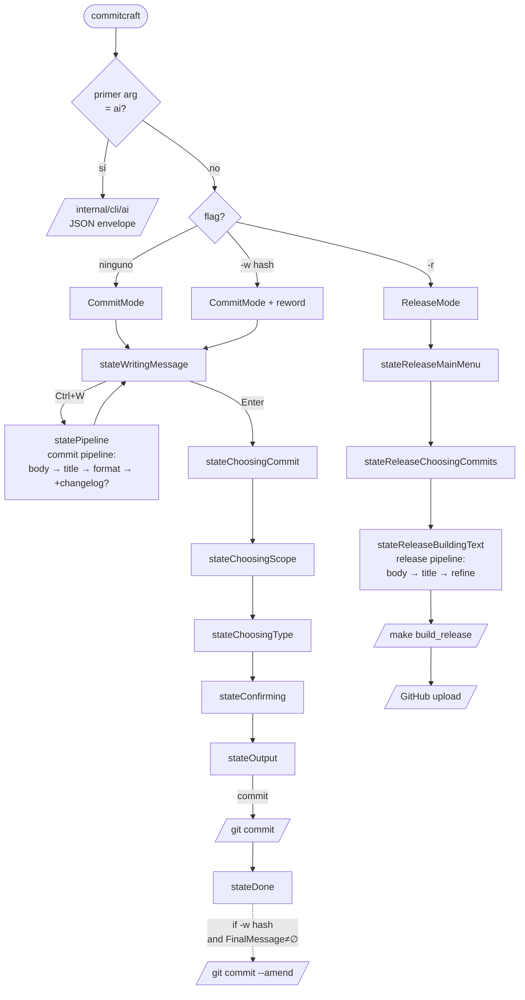

# Architecture Context

## Stack

| Layer        | Technology                                       | Role                                                                  |
| ------------ | ------------------------------------------------ | --------------------------------------------------------------------- |
| Language     | Go 1.25                                          | All code; module name `commit_craft_reborn`                           |
| TUI runtime  | `charm.land/bubbletea/v2`                        | Elm-style Model/Update/View loop; async via `tea.Cmd`                 |
| TUI widgets  | `charm.land/bubbles/v2`                          | List, textarea, viewport, spinner primitives                          |
| Styling      | `charm.land/lipgloss/v2` + `charmtone`           | All foreground/background/border styles                               |
| Markdown     | `charm.land/glamour/v2`                          | Render real markdown (release notes, changelog) in TUI viewports      |
| Commit text  | Custom renderer (`view_writing.go::renderCommitMessage`) | Render commit messages — *not* markdown                          |
| Logging      | `charm.land/log/v2`                              | Structured logger; `internal/logger`                                  |
| Config       | `BurntSushi/toml` + `joho/godotenv`              | TOML config (global + local); `.env` for `GROQ_API_KEY`               |
| Database     | `modernc.org/sqlite` (pure-Go SQLite)            | Local persistence; no CGO needed                                      |
| HTTP / LLM   | stdlib `net/http` → Groq REST API                | `internal/api/groq.go`                                                |
| Clipboard    | `atotto/clipboard`                               | Copy commit messages from output view                                 |

## Operating Modes

CommitCraft has **two top-level modes**. The mode is captured in `model.AppMode` (`CommitMode` | `ReleaseMode`) and selects both the visible flow and the AI pipeline.

| Mode             | How it's entered                                  | Pipeline used     | What it produces                              |
| ---------------- | ------------------------------------------------- | ----------------- | --------------------------------------------- |
| **CommitMode**   | Default launch (no flag), or `-w <hash>` (reword) | Commit pipeline   | A single conventional commit message          |
| **ReleaseMode**  | `-r` flag, or `r` shortcut from main menu         | Release pipeline  | A release/merge note (title + body)           |

The eventual `RELEASE` vs `MERGE` classification is chosen in the type popup *after* the pipeline runs and is persisted as `storage.Release.Type`; both classifications use the same pipeline with the same prompts.

## System Boundaries

- `cmd/cli/main.go` — entrypoint. Parses flags (`-r`, `-o`, `-w`), loads config, opens DB, builds `tui.Model`, runs Bubble Tea program. Routes `commitcraft ai ...` to headless dispatcher before any TUI bootstrap.
- `internal/api/` — Groq HTTP client. Owns rate-limit parsing/cache (`ratelimit_cache.go`). No business logic.
- `internal/aiengine/` — orchestration of LLM stages (commit body, title, format, release-changelog refiner). Pure functions over `Deps` + prompt templates. No TUI types leak in.
- `internal/storage/` — SQLite wrapper. `database.go` owns `InitDB`, `createTables`, `applySchemaMigrations`. `queries.go` exposes typed query methods on `*DB`. Models in `types.go` and `models_cache.go`.
- `internal/git/` — shells out to `git` for status, diff, branches, commit lookup, reword. `git.go` for read/write, `status.go` for status parsing.
- `internal/config/` — config types, loader, save model, prompt embeds (`prompts/`), commit-type palette resolution, free-models metadata.
- `internal/commit/` — commit-type catalog and final-message formatting.
- `internal/changelog/` — read/write `CHANGELOG.md`.
- `internal/cli/ai/` — headless subcommand dispatcher (`ai.go`) plus one file per subcommand (`generate`, `regenerate`, `edit`, `show`, `list`, `promote`, `list-tags`, `list-addable-tags`, `add-tag`, `stage-partial`). Reuses `aiengine`, `storage`, `git`, `config`. Always emits JSON.
- `internal/tui/` — the entire Bubble Tea app. State machine, all popups, all rendering. Subpackages: `tui/styles/` (themes), `tui/statusbar/`, `tui/prompts/`. Files split by feature (`update_*.go`, `view_*.go`, `pipeline_*.go`, `release_*.go`, `*_popup.go`).
- `internal/logger/` — singleton logger configuration.

## State Machine (TUI)

States declared in `internal/tui/model.go`, grouped by mode:

**CommitMode states**

- `stateWritingMessage` — left input + right AI suggestion panel.
- `statePipeline` — per-stage commit pipeline view (body / title / format / optional changelog).
- `stateChoosingCommit` — main list (commits + drafts).
- `stateChoosingScope` — pick scope from staged files.
- `stateChoosingType` — pick commit type from the catalog.
- `stateConfirming` — final confirmation before `git commit`.
- `stateOutput` — preview / copy / commit / discard the final message.
- `stateRewordSelectCommit` — used when `-w` is launched without a hash, or to pick another target.
- `stateDone` — terminal state after success.

**ReleaseMode states**

- `stateReleaseMainMenu` — entry point; toggles release/merge sub-mode and chooses build/upload action.
- `stateReleaseChoosingCommits` — multi-select commit picker for the release note.
- `stateReleaseBuildingText` — release pipeline view (body → title → refine), Make build, GitHub upload progress.

**Cross-mode states**

- `stateSettingAPIKey` — first-run / missing-key prompt.
- `stateShowLogs` — logs popup-state.

**Critical transitions**

- _CommitMode:_ `stateWritingMessage` → Ctrl+W → commit pipeline → `IaCommitBuilderResultMsg` → stays in `stateWritingMessage` (suggestion shown).
- _CommitMode:_ `stateWritingMessage` → Enter → `createCommit()` → `stateChoosingCommit`.
- _CommitMode:_ `stateChoosingCommit` → Ctrl+D → toggle drafts-only filter (no state change).
- _ReleaseMode:_ `stateReleaseMainMenu` → pick commits → `stateReleaseChoosingCommits` → confirm → `stateReleaseBuildingText` (release pipeline runs).
- _Mode switching:_ `stateChoosingCommit` ↔ `stateReleaseMainMenu` via the mode-switch action (`update_release.go:650-654`).
- ESC returns to the previous state within the active mode.
- `-w <hash>` boots directly into the reword flow under CommitMode; on exit, if `FinalMessage != ""`, runs `git.RewordCommit`. Otherwise prints a stderr cancel notice and exits 0.

## Storage Model

- **SQLite** (`~/.config/CommitCraft/commitcraft.db` — exact path resolved by `storage.InitDB`):
  - `commits` — every generated commit/draft (state, type, scope, body, title, final message, timestamps).
  - per-stage `ai_calls` rows (model, tokens, latency, prompt hashes) linked to a commit.
  - `model_rate_limits` — last-known Groq rate-limits per model, hydrated on startup so the compose-tab bars aren't empty.
  - `models_cache` — Groq model catalog snapshot.
- **Filesystem**:
  - Global config: `~/.config/CommitCraft/config.toml`.
  - Repo config (overrides): `.commitcraft.toml` at repo root (gitignored — may contain `GH_TOKEN`).
  - API key: `~/.config/CommitCraft/.env` → `GROQ_API_KEY`.
  - Custom prompts: `~/.config/CommitCraft/prompts/*.prompt.tmpl` (override embedded `internal/config/prompts/`).
  - Built binaries: `bin/` (release mode output target).
- **Embedded** (`go:embed` in `internal/config/prompts/`): default prompt templates (`summary`, `commit_builder`, `output_format`, `only_translate`).

## Auth and Access Model

- Single local user; no multi-tenant concept.
- Groq API key is the only credential. Loaded from env, then `.env`, then interactive `stateSettingAPIKey` prompt.
- GitHub release upload uses `GH_TOKEN` from `[release_config]` in `.commitcraft.toml`.

## AI Pipelines

There are **two pipelines**, one per operating mode. Both render through the same per-stage UI (`statePipeline` cards / `stateReleaseBuildingText` cards), share the `aiengine.StageStats` telemetry shape, and run as async `tea.Cmd`s. The pipeline preset is selected via `pipelineModel.preset` (`pipelinePresetCommit` | `pipelinePresetRelease`, defined in `internal/tui/pipeline_state.go:19-23`).

### Commit pipeline (CommitMode)

Driven from `stateWritingMessage` (Ctrl+W) → renders in `statePipeline`. Lives in `internal/tui/ai_pipeline.go`.

1. **Body stage** (`iaCallCommitBodyGenerator`) — diff summary → bullet body.
2. **Title stage** (`iaCallCommitTitleGenerator`) — body → conventional-commit subject.
3. **Format stage** — final message assembly.
4. **Changelog refiner** *(optional)* — `runChangelogRefiner`. Produces a `CHANGELOG.md`-shaped entry from the final commit message; runs only when the user opts in.

Entry point: `ia_commit_builder(model)`.

### Release pipeline (ReleaseMode)

Driven from `stateReleaseChoosingCommits` confirmation → renders in `stateReleaseBuildingText`. Pure-orchestration code lives in `internal/aiengine/release.go::RunRelease`; the TUI wrapper is `iaReleaseBuilder` in `ai_pipeline.go:213`.

1. **Body stage** (`ReleaseStageBody`) — selected commits blob → release-note body. Prompt: `Cfg.Prompts.ReleaseBodyPrompt`.
2. **Title stage** (`ReleaseStageTitle`) — body + commits → release title. Prompt: `Cfg.Prompts.ReleaseTitlePrompt`.
3. **Refine stage** (`ReleaseStageRefine`) — title + body → final polished note. Prompt: `Cfg.Prompts.ReleaseRefinePrompt`.

After the pipeline, the release flow continues outside AI: Make build (`build_release` target) → upload to GitHub via `GH_TOKEN` from `[release_config]`.

### Shared concerns

- Each stage persists an `aiengine.StageStats` row in the DB via `persistAICalls`.
- Rate-limit headers from every Groq response update `api.RecordRateLimits`, which feeds the per-model bars in the compose tab and model picker footer.
- Per-stage history (last N outputs) is kept in `pipelineModel.stages[*].history` so users can flip back through retries without re-calling the API.

## Text Rendering

Two distinct renderers are used in the TUI depending on whether the content **is** markdown.

### Glamour (real markdown)

`charm.land/glamour/v2`, configured with `TokyoNightStyleConfig` and per-viewport wrap width.

Used for:

- **Release-mode preview viewport** (`view_release.go:336-342`) — the AI-generated release note is markdown.
- **Release-mode changelog viewport** (`view_release.go:423-427`) — `CHANGELOG.md` content already on disk.
- Anywhere in `view_release.go` showing markdown sourced from `model.commitLivePreview` when the source is a release note (not a commit message).

Each render call instantiates a `glamour.NewTermRenderer` with a `glamourGutter = 3` so wrapping accounts for the viewport's horizontal frame.

### Custom commit renderer (`renderCommitMessage`)

Lives in `internal/tui/view_writing.go:257-303`. **Bypasses glamour deliberately** because commit messages are *not* markdown — running them through a markdown renderer would collapse single newlines, mangle indented bullets into code blocks, and merge lazy continuations into one paragraph. Documented inline in `view_writing.go:250-256`.

Behavior:

- **Title** (first line) — `theme.Primary` + bold.
- **Body** (subsequent lines) — `theme.FG`.
- **Inline `` `code` `` segments** (backtick-wrapped) — `theme.Secondary` foreground on `theme.Surface` background. Unmatched trailing backticks render as literal text, never swallow user content.
- **Identifiers** — `styleIdentifiers` helper picks out symbol-like tokens for code styling outside backticks.
- **Width-wrapping is per line**, applied via `textStyle.Width(width).Render(...)`. The user's hand-typed line breaks survive verbatim.

Used by (search for `renderCommitMessage`):

- `view_writing.go` — AI suggestion panel and translate preview.
- `view_output.go` — final commit message preview before `git commit`.
- `history_dual_panel.go` — right-panel detail view in commit/draft history. Injects the renderer via `*Model.renderCommitMessage` to stay decoupled from the model.
- `stage_history_popup.go` — keeps the per-stage preview consistent with whatever the underlying card uses (glamour for analyzer/release stages, `renderCommitMessage` for commit body/title/changelog stages).
- `view_release.go:133-134` — when `commitLivePreview` is a commit, not a release note.

### Routing rule

If the source text is markdown (release notes, `CHANGELOG.md`), use **glamour**. If the source is a commit message (title + body, or AI-stage output that is destined to *become* a commit message), use **`renderCommitMessage`**. The two are not interchangeable: glamour over a commit body destroys formatting; `renderCommitMessage` over markdown ignores headings, lists, and links.

## Invariants

1. **Focus returns `tea.Cmd`** — `Update` always captures and returns commands; `View` is pure render with zero side effects.
2. **DB schema changes go through `applySchemaMigrations`** — never edit `createTables`. Old DBs in the wild must keep working.
3. **No raw colors in render code** — every style reads from `model.Theme`. Hex strings only allowed inside `internal/tui/styles/*.go` theme constructors.
4. **Help-line and popup key hints render through `theme.AppStyles().Help`** (`ShortKey` / `ShortDesc` / `ShortSeparator`). Never a flat `Foreground(theme.Muted)`.
5. **Headless CLI never spawns the TUI** — `if os.Args[1] == "ai"` short-circuits in `main.go` before any Bubble Tea code runs.
6. **CommitCraft never runs `git push`** — only `git commit` and `git commit --amend`. Pushes are the user's responsibility.
7. **Reword never amends with an empty message** — if `FinalMessage` is blank, exit 0 with a stderr notice; do not call `git commit --amend -m ""`.
8. **Every version bump in `cmd/cli/main.go` requires a `CHANGELOG.md` entry** in English at the top.

## Flow Overview

End-to-end map from launch to terminal action. CommitMode (left) and ReleaseMode (right) share only the entry point and the cross-mode states.

**Cómo leerlo**

- Cajas `[…]` = estados del state-machine (TUI).
- Cajas con `/…/` = acciones externas (shell out a git, build, upload, output JSON).
- Línea punteada `-.->` = transición condicional al salir del programa, no dentro del loop de Bubble Tea.
- ESC y popups (logs, config, model picker, scope/type/etc.) no aparecen — el diagrama es del flujo principal, no exhaustivo.
